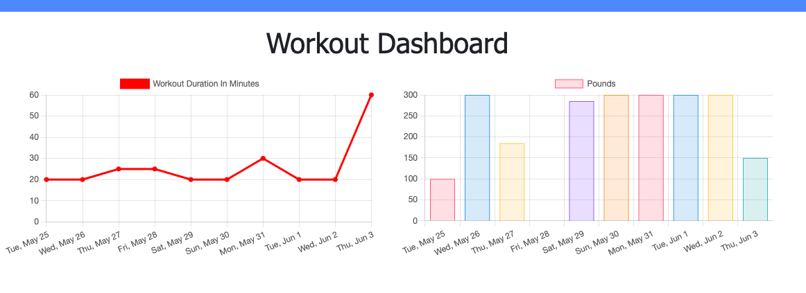
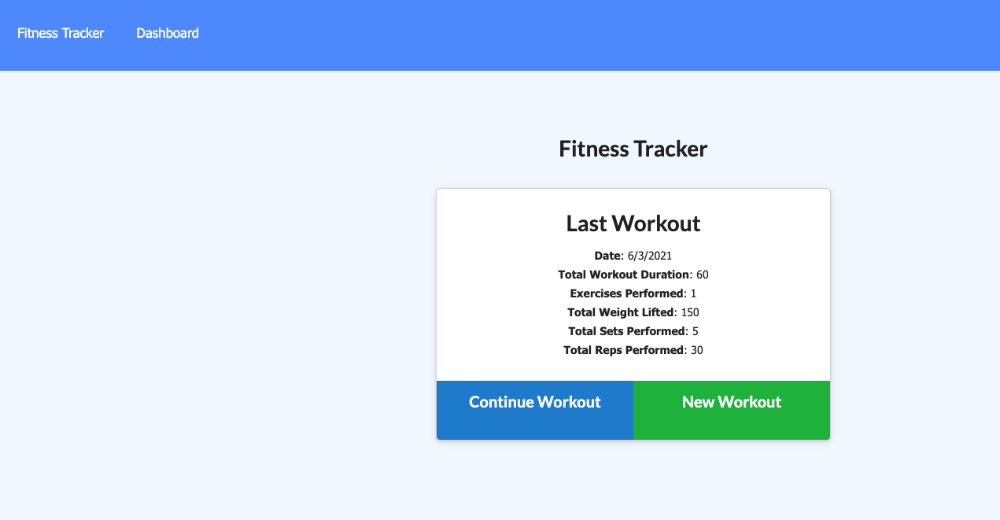

# TrackMyWorkout
A simple workout tracking app using MongoDB and Express.

## Author
Tomasz Siemion

## Links
Deploy:
Github: https://github.com/rotosti/TrackMyWorkout

## Description
A simple workout tracking application where a user can document their workouts, as well as update any workouts and see a graphical representation of their workouts on the dashboard.

## Dependency

Use the package.json to install any modules via the command:

```
npm i
```

## Usage
Add your workouts, keep track of progress!

## Screens


